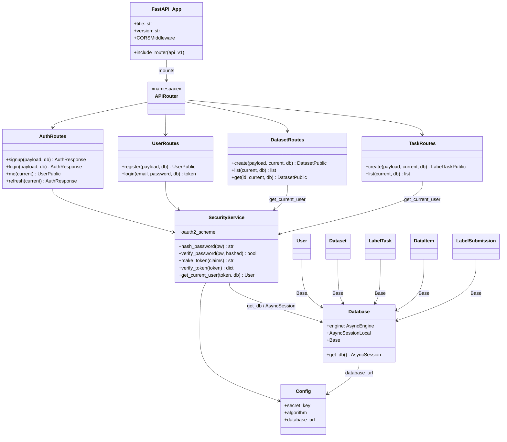

# Class / Module Diagram v1

## Notes

- Routers live in `app/api/v1/`, models in `app/models/`, and `SecurityService`
  covers JWT + bcrypt so routes stay thin.
- `get_current_user` is a shared FastAPI dependency: it decodes the token and
  returns the logged-in user, which is what keeps dataset/task routes scoped.
- Pydantic schemas (`app/schemas/`) sit between routes and models for
  request validation / response serialization.