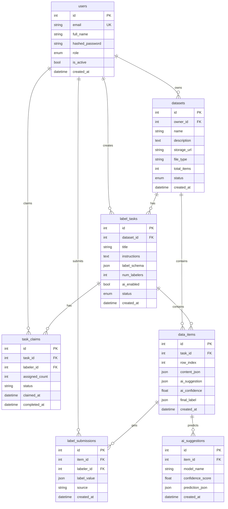

# ER Diagram v1

## Notes

- `users.role` is one of `owner | labeler | admin`.
- A dataset belongs to one owner. Label tasks hang off a dataset; each dataset
  row becomes a `data_items` row per label task.
- Labelers claim work through `task_claims` (junction between task + labeler,
  with a claim status) then submit labels in `label_submissions`. Multiple
  labelers can label the same item (that's the `num_labelers` setting).
- `ai_suggestions` stores model predictions per item; `ai_suggestion` /
  `ai_confidence` on the item itself feed the human-in-the-loop flow planned
  for later sprints. 7 tables total.